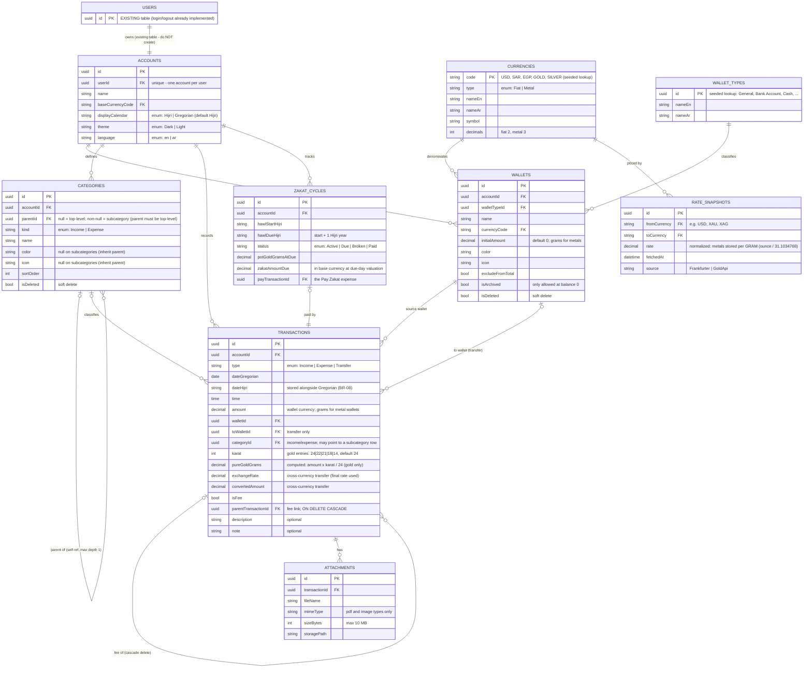

# Meezan — Canonical Specification

> **Audience:** Claude AI agents (and developers) planning and implementing Meezan.
> **This file is the single source of truth.** A copy lives in BOTH repositories:
> the backend repo (.NET Core) and the frontend repo (Angular). Repo-specific
> implementation guidance lives in `Meezan.md` and `meezan-frontend.md`,
> each of which defers to this file. If this file and a guide conflict, this file wins.
>
> Scope of this phase: **web application** (Angular frontend + ASP.NET Core backend).
> A mobile application follows in a later phase. Recurring transactions are **out of scope** (future).

---

## 1. Product Overview

Meezan is a personal finance web application for managing income and expenses. Users
organize their money into wallets of different currencies — including physical gold and
silver measured in grams — record income, expenses, and transfers, and analyze their
finances through period overviews, a calendar, and category statistics.

Meezan's distinguishing feature is the **Zakat module**: the application tracks the user's
total wealth as its equivalent in grams of pure (24K) gold, monitors the nisab threshold
(85 g), counts the hawl (one full Islamic year) on the **Hijri calendar**, and tells the
user exactly when Zakat is due and how much (2.5%). This is why the Hijri calendar is the
primary calendar of the system.

The UI supports **English and Arabic** (full RTL) and **dark/light themes**.

## 2. Core Concepts

- **User** — authenticated via the EXISTING user table in the backend (login/logout already
  implemented). Do not create a new user table.
- **Account** — exactly ONE per user. Created with a name and a base currency (mandatory,
  from a predefined list) and an optional initial amount (default 0). The base currency
  defines how the total balance is displayed and can be changed later in Settings —
  including to gold, in which case the total is shown in grams.
- **Wallet** — one place money lives. Fields: name, type (lookup: General, Bank Account,
  Cash, …), color, icon, exactly one currency (USD, SAR, EGP, GOLD, SILVER), initial
  amount, exclude-from-total flag. Metal balances are stored in grams (3 decimals).
- **Transaction** — Income | Expense | Transfer. Dual date (Hijri + Gregorian) + time,
  amount, wallet (transfer: from + to), category/subcategory (income & expense only),
  optional description, note, attachments, optional linked fee.
- **Category** — per kind (Income | Expense); single self-referencing table; a subcategory
  is a category row with a parentId, has a name only, and inherits its parent's color/icon.
- **Zakat cycle (hawl)** — a tracked Islamic year during which the zakat pot stays at or
  above nisab; completing it makes 2.5% zakat due.

## 3. Business Rules

- **BR-01 Account.** One account per user. Name and base currency mandatory (base currency
  from the predefined currency list); initial amount optional, default 0.
- **BR-02 Wallet currency.** Each wallet has exactly one currency. Metal (gold/silver)
  balances are entered and stored in grams with 3-decimal precision (x.xxx).
- **BR-03 Gold karat.** Every gold amount entry carries a karat: 24 (default), 22, 21, 18,
  or 14, selected from a dropdown. Pure-gold (24K) equivalent = weight × (karat ÷ 24).
  General conversion between karats: newWeight = (originalWeight × originalPurity) ÷ newPurity
  (purities: 24K ≈ 0.999 treated as 1.0, 22K ≈ 0.916, 21K = 0.875, 18K = 0.75, 14K ≈ 0.583).
  The wallet screen displays the RAW purchased grams (with karat breakdown available);
  Zakat calculations always use the pure 24K equivalent. Silver has no karat.
- **BR-04 Exclude flag.** Wallets flagged excludeFromTotal are omitted from BOTH the
  account total balance AND the Zakat pot. There is no credit/debit wallet type; the
  statistics ending-balance note refers to excluded wallets only.
- **BR-05 Archive.** A wallet can be archived only when its balance is exactly 0.
- **BR-06 Soft delete.** Deleting a category or wallet referenced by transactions is a
  soft delete (isDeleted = true). Historical transactions keep displaying it. When editing
  such a transaction, the deleted item appears as the currently selected value but is NOT
  present in the dropdown; once the user changes the selection, the deleted item can never
  be selected again. Unreferenced categories/wallets may be hard-deleted.
- **BR-07 Mandatory fields.** Every transaction: date + time, amount > 0, wallet.
  Income/Expense additionally: category or subcategory. Transfer additionally: from-wallet
  and to-wallet (must differ). Optional: description, note, attachments, fee.
- **BR-08 Dual calendar.** Every transaction stores BOTH the Hijri and Gregorian date.
  The user's display-calendar setting decides which is shown. Hijri is the PRIMARY
  calendar of the system (Zakat depends on it).
- **BR-09 Fees.** A fee is a SEPARATE transaction (isFee = true) linked to its parent via
  parentTransactionId. It appears independently in overviews/statistics. Deleting the
  parent CASCADES: the linked fee transaction is deleted with it.
- **BR-10 Cross-currency transfer.** When from/to wallets differ in currency, the latest
  rate snapshot is pre-filled; the user may keep it or override the rate or the converted
  amount per transaction. The source wallet is debited in its currency; the destination is
  credited with the converted amount. The final rate used is stored on the transaction.
- **BR-11 Overview math.** Net income (Total) = income − expense, for the selected period.
  Period filters: daily, weekly, monthly, quarterly, yearly, all, custom range. The
  transaction list follows the same filter, grouped by day.
- **BR-12 Total balance.** Account total = Σ balances of non-excluded wallets converted to
  the base currency at the latest rates. If base currency = GOLD, the total is displayed
  in grams.
- **BR-13 Zakat pot.** Pot = Σ ALL non-excluded wallets — cash, gold, AND silver COMBINED
  (jumhur position: Hanafi, Maliki, a narration from Ahmad; followed by most contemporary
  fatwas) — valued at CURRENT market prices (purchase prices are irrelevant), expressed as
  its pure-gold-gram equivalent (pot value ÷ price of 1 g of 24K gold).
- **BR-14 Nisab.** Nisab = 85 g of pure gold. When the pot reaches ≥ 85 g, a hawl starts
  on that Hijri day.
- **BR-15 Hawl.** If the pot stays ≥ nisab for one full Hijri year, zakat is due:
  2.5% of the pot valued on the due day. The pot is re-evaluated after every
  balance-affecting transaction and on each daily rate refresh. If it drops below nisab
  before the year completes → cycle status = Broken, the Zakat screen shows
  "The total has not reached the nisab", and a NEW cycle starts whenever nisab is reached
  again.
- **BR-16 Reminder.** If zakat will be due, a toast notification is shown at portal login,
  starting two weeks before hawl completion.
- **BR-17 Pay Zakat.** The action creates an expense transaction for the due amount from a
  wallet the user chooses, marks the cycle Paid, and — if the post-payment pot is still
  ≥ the 85 g equivalent — starts a new hawl immediately.
- **BR-18 Recurring.** Out of scope for this phase (future work). Do not implement.
- **BR-19 Exchange rates.** Provider: **Frankfurter API v2** (`api.frankfurter.dev/v2`,
  free, no API key) as the single source for FX (USD/SAR/EGP) AND metals (XAU gold, XAG
  silver — quoted per troy ounce; per-gram price = per-ounce price ÷ 31.1034768).
  Fallback for metals: gold-api.com. A scheduled background job fetches rates in batched
  calls at a config-driven frequency (daily is sufficient); snapshots are APPEND-ONLY in
  RateSnapshots (history preserved for zakat's price-on-hawl-day valuation). The
  application NEVER calls the external API on a user action: reads go through Redis
  (latest snapshot cached; DB fallback on miss). Transaction forms pre-fill the latest
  snapshot rate; the user may keep or change it (BR-10). On fetch failure, the last
  snapshot remains in use, displayed as "rates as of {fetchedAt}".
  See §7 Rate Integration Architecture.
- **BR-20 Localization.** UI languages: English and Arabic, switchable in Settings.
  Arabic = full RTL mirroring. All UI strings localized; backend-generated messages
  (validation errors, zakat messages, login toast) localized via Accept-Language (en|ar).
  Dates render per locale (Hijri month names in Arabic when in AR). **Number and amount
  formatting stays English (Western digits 0-9) in BOTH languages.** User free-text
  (descriptions, notes, names) may be in either language and is stored as-is (Unicode).
  Seeded lookup data (categories, wallet types) ships with EN + AR names.

## 4. Zakat Calculation Model

### 4.1 Karat purity table

| Karat |  Purity factor | 10 g equals (pure 24K) |
| ----: | -------------: | ---------------------: |
|   24K | 1.000 (≈0.999) |               10.000 g |
|   22K |          0.916 |                9.167 g |
|   21K |          0.875 |                8.750 g |
|   18K |          0.750 |                7.500 g |
|   14K |          0.583 |                5.833 g |

`pureGrams = grams × (karat ÷ 24)` · Example: 24 g of 22K = 24 × 22 ÷ 24 = 22 g pure.

### 4.2 Worked pot example (valuation on the hawl day)

| Asset                 | Holding      | Price on hawl day | Value                             |
| --------------------- | ------------ | ----------------- | --------------------------------- |
| Cash                  | 500,000 EGP  | —                 | 500,000                           |
| Gold                  | 100 g (pure) | 5,000 / g         | 500,000                           |
| Silver                | 5 kg         | 150,000 / kg      | 750,000                           |
| **Pot (وعاء الزكاة)** |              |                   | **1,750,000 EGP** → nisab reached |
| **Zakat (2.5%)**      |              |                   | **43,750 EGP**                    |

Purchase price never matters — only the market price on the day zakat becomes due.

### 4.3 Hawl state machine

```
            pot ≥ 85g (pure-gold equivalent)
  (no cycle) ────────────────────────────────► ACTIVE (hawlStartHijri = today-Hijri)
      ▲                                           │
      │  pot < nisab at any re-evaluation         │ one full Hijri year with pot ≥ nisab
      │  → show "The total has not reached        ▼
      └── the nisab"            BROKEN ◄──── … ── DUE (zakatAmountDue = 2.5% × pot value
                                                       valued on the due day)
                                                   │ "Pay Zakat" → expense transaction
                                                   ▼
                                                 PAID ──► if post-payment pot ≥ nisab:
                                                          new ACTIVE cycle starts immediately
```

Re-evaluation triggers: every balance-affecting transaction (create/edit/delete) and every
daily rate refresh. Reminder toast at login from `hawlDueHijri − 14 days` while status
will be DUE (BR-16).

### 4.4 Display rules

- The Zakat screen shows: pot in pure-gold grams, nisab status, hawl progress (Hijri
  dates), amount due when applicable, zakat history (past cycles), and the
  "Pay Zakat" action.
- Wallet screens show RAW holdings: a gold wallet displays the grams the user purchased
  (karat breakdown available), not the pure equivalent.
- The account header total converts to the base currency (grams when base = GOLD).

## 5. Data Model

### 5.1 Entity relationship diagram (Mermaid)



### 5.2 Modeling decisions (binding)

1. **USERS is the existing table** — reference it; never create or migrate it.
2. **Categories and subcategories are ONE self-referencing table.** Enforce max depth 1 in
   the application layer (a row with parentId set must reference a row whose parentId is
   null); children leave color/icon null and resolve them from the parent.
3. **Enums, persisted as strings:** transaction type, category kind, currency type,
   display calendar, theme, language, zakat cycle status. **Lookup tables (seeded data):**
   CURRENCIES, WALLET_TYPES — they carry attributes (EN/AR names) and may grow without
   code changes.
4. **Single TRANSACTIONS table** for all three types; nullable columns used per type as in
   the ERD; the self-reference implements the fee link with cascade delete (BR-09).
5. **RATE_SNAPSHOTS is append-only** (inserts only) and stores metal prices normalized to
   per-gram.

## 6. API Contract (high level)

The backend implements this contract; the frontend consumes it. The backend agent
generates the authoritative OpenAPI/Swagger from code — this map fixes resources, verbs,
and key fields. All endpoints require the existing authentication; all accept
`Accept-Language: en|ar` for localized messages (BR-20). Conventions: JSON, camelCase,
RFC 7807 problem+json for errors, UTC timestamps.

| #   | Endpoint                                  | Verb               | Purpose / key fields                                                                                                                                                                |
| --- | ----------------------------------------- | ------------------ | ----------------------------------------------------------------------------------------------------------------------------------------------------------------------------------- |
| 1   | `/api/account`                            | GET                | The user's account + settings + total balance in base currency                                                                                                                      |
| 2   | `/api/account`                            | POST               | First-run setup: name, baseCurrencyCode, initialAmount? (BR-01)                                                                                                                     |
| 3   | `/api/account/settings`                   | PUT                | baseCurrencyCode, displayCalendar, theme, language                                                                                                                                  |
| 4   | `/api/lookups/currencies`                 | GET                | Seeded currency list (code, type, EN/AR names, decimals)                                                                                                                            |
| 5   | `/api/lookups/wallet-types`               | GET                | Seeded wallet types (EN/AR names)                                                                                                                                                   |
| 6   | `/api/wallets`                            | GET                | All wallets (raw balances; gold: grams + karat breakdown)                                                                                                                           |
| 7   | `/api/wallets`                            | POST               | name, walletTypeId, currencyCode, initialAmount?, color, icon, excludeFromTotal                                                                                                     |
| 8   | `/api/wallets/{id}`                       | PUT                | Edit wallet fields                                                                                                                                                                  |
| 9   | `/api/wallets/{id}`                       | DELETE             | Soft/hard delete per BR-06                                                                                                                                                          |
| 10  | `/api/wallets/{id}/archive`               | POST               | Archive; 422 if balance ≠ 0 (BR-05)                                                                                                                                                 |
| 11  | `/api/categories?kind=`                   | GET                | Tree (top-level + children) for kind; excludes soft-deleted                                                                                                                         |
| 12  | `/api/categories`                         | POST               | name, kind, color, icon — or parentId + name for a subcategory                                                                                                                      |
| 13  | `/api/categories/{id}`                    | PUT / DELETE       | Edit / delete per BR-06                                                                                                                                                             |
| 14  | `/api/transactions`                       | GET                | Filtered list: period or from/to, wallet, category, type; grouped-by-day payload                                                                                                    |
| 15  | `/api/transactions/search?q=`             | GET                | Free-text search                                                                                                                                                                    |
| 16  | `/api/transactions`                       | POST               | type, dates, time, amount, walletId, toWalletId?, categoryId?, karat?, exchangeRate?, convertedAmount?, description?, note?, fee? {amount} → creates linked fee transaction (BR-09) |
| 17  | `/api/transactions/{id}`                  | GET / PUT / DELETE | Read / edit (BR-06 dropdown rule) / delete (fee cascades)                                                                                                                           |
| 18  | `/api/transactions/{id}/attachments`      | POST               | multipart; ≤ 10 MB; pdf + images only                                                                                                                                               |
| 19  | `/api/attachments/{id}`                   | GET / DELETE       | Download / remove                                                                                                                                                                   |
| 20  | `/api/overview?period=&from=&to=`         | GET                | income, expense, total for the filter (BR-11)                                                                                                                                       |
| 21  | `/api/calendar?year=&month=`              | GET                | Per-day {income, expense, total} + month totals                                                                                                                                     |
| 22  | `/api/statistics?period=`                 | GET                | openingBalance, endingBalance, excludedNote, overview                                                                                                                               |
| 23  | `/api/statistics/structure?kind=&period=` | GET                | Donut data: per category {percent, amount, txCount}                                                                                                                                 |
| 24  | `/api/rates/latest?base=&quotes=`         | GET                | Latest snapshot rates (never live-calls the provider)                                                                                                                               |
| 25  | `/api/zakat/status`                       | GET                | Pot (pure-gold grams + base-currency value), nisab status, active cycle, hawl progress, amount due                                                                                  |
| 26  | `/api/zakat/cycles`                       | GET                | Cycle history                                                                                                                                                                       |
| 27  | `/api/zakat/pay`                          | POST               | walletId → creates the zakat expense, marks cycle Paid, may start a new hawl (BR-17)                                                                                                |
| 28  | `/api/notifications/login`                | GET                | Pending login toasts (zakat reminder, BR-16)                                                                                                                                        |

## 7. Rate Integration Architecture

Patterns: **Adapter (anti-corruption layer)** + **Strategy/fallback composite** +
**resilient HTTP gateway** + **cache-aside with a scheduled worker**.

```
RateSyncJob (scheduled; daily, config-driven)
   └─> CompositeRateProvider : IRateProvider          [Strategy / fallback chain]
         ├─> FrankfurterRateProvider                   [Adapter + typed HttpClient + Polly]
         │     GET /v2/rates?base=USD&quotes=SAR,EGP
         │     GET /v2/rates?base=XAU&quotes=USD,SAR,EGP   (gold, per troy ounce)
         │     GET /v2/rates?base=XAG&quotes=USD,SAR,EGP   (silver, per troy ounce)
         │     normalize: metal per-gram = per-ounce ÷ 31.1034768
         └─> GoldApiRateProvider (metals fallback)     [Adapter + typed HttpClient + Polly]
   └─> INSERT RateSnapshots (append-only) ──> refresh Redis (latest per pair)

Application reads: Redis → on miss, latest DB snapshot → populate Redis.
User actions NEVER call the external provider. (BR-19)
```

- `IRateProvider` returns the internal `RateQuote` model {pair, ratePerUnit,
  ratePerGram?, fetchedAt, source} — the rest of the system never sees provider schemas.
- Polly policies on the typed HttpClient: timeout, retry with exponential backoff,
  circuit breaker (job fails fast when the provider is down; last snapshot keeps serving).
- Self-hosting escape hatch: Frankfurter is open source and Docker-deployable; switching
  to a self-hosted instance is a base-URL config change only.

## 8. Localization (BR-20 details)

- Languages: `en`, `ar`. Selector in Settings; persisted on the account.
- Arabic = `dir="rtl"` and full layout mirroring (see frontend guide).
- Dates: Hijri with Arabic month names in AR (محرم، صفر، …), localized Gregorian; the
  display-calendar setting (BR-08) is independent of language.
- Numbers/amounts: ALWAYS Western digits (0-9) and English number formatting, in both
  languages.
- Backend messages localized via `Accept-Language`; localized strings include validation
  errors, "The total has not reached the nisab", and the zakat login toast.
- Seeded data (categories, wallet types, currencies) carries nameEn + nameAr.

## 9. Use Cases

Format: Actor · Preconditions · Main flow · Alternate flows · Acceptance criteria.
The actor is the authenticated user unless stated; "System" marks background use cases.

### Setup & Settings

**UC-01 Create account (first run)**

- Preconditions: user authenticated (existing auth); no account exists yet.
- Main flow: 1. User enters account name. 2. Selects base currency from the predefined
  list. 3. Optionally enters an initial amount (default 0). 4. System creates the account
  and a default Cash wallet holding the initial amount.
- Alternate: A1 initial amount skipped → 0.
- Acceptance: Given no account, When name+currency submitted, Then account exists with
  chosen base currency And a Cash wallet with the initial amount And the main screen opens.

**UC-02 Change base currency**

- Preconditions: account exists.
- Main flow: Settings → base currency → pick new currency → totals re-convert at latest
  snapshot rates.
- Acceptance: Given base SAR and wallets in mixed currencies, When base → USD, Then the
  header total shows USD; When base → GOLD, Then the total shows grams (BR-12).

**UC-03 Switch theme / language / display calendar**

- Main flow: Settings toggles; language switch flips the whole layout to RTL for Arabic
  (BR-20); calendar switch flips displayed dates Hijri ⇄ Gregorian (BR-08).
- Acceptance: Given language ar, Then UI is RTL with Arabic strings And numbers remain
  Western digits.

### Wallets

**UC-04 Add wallet**

- Main flow: name, type (lookup), currency, optional initial amount, color, icon,
  excludeFromTotal → save.
- Acceptance: wallet appears with initial balance; excluded wallets don't move the header
  total (BR-04).

**UC-05 Edit wallet** — same fields; currency change is blocked once transactions exist.

**UC-06 Archive wallet**

- Main flow: archive action on a zero-balance wallet.
- Alternate: A1 balance ≠ 0 → blocked with a localized message (BR-05).
- Acceptance: Given balance 0, When archived, Then wallet leaves active lists but history
  remains.

**UC-07 Delete wallet**

- Main flow: delete → if unreferenced, hard delete.
- Alternate: A1 referenced by transactions → soft delete (BR-06).
- Acceptance: Given a soft-deleted wallet, Then old transactions still display it And it
  is absent from wallet dropdowns And once a transaction's wallet is changed it cannot be
  re-selected.

**UC-08 Add gold entry (income into a gold wallet)**

- Main flow: 1. Income form on a gold wallet. 2. Enter grams (x.xxx). 3. Karat dropdown —
  24K default; 22/21/18/14 available. 4. System computes pureGoldGrams = grams × karat ÷ 24.
- Acceptance: Given 24 g at 22K, Then pureGoldGrams = 22.000 And the wallet screen shows
  24 g purchased (BR-03) And the zakat pot uses 22 g.

### Categories

**UC-09 Add category** — name, color, icon, kind (Income|Expense). Acceptance: appears in
the kind's tree and dropdowns.

**UC-10 Add subcategory**

- Main flow: choose parent category first, then enter the name only.
- Acceptance: child renders with the parent's color and icon (BR-06 §2 depth guard: parent
  must be top-level).

**UC-11 Edit / delete category**

- Alternate: A1 delete while referenced → soft delete with the BR-06 dropdown behavior.

### Transactions

**UC-12 Add expense**

- Preconditions: ≥ 1 wallet exists; ≥ 1 expense category exists.
- Main flow: 1. Open + → Expense tab. 2. Pick date (dual Hijri/Gregorian picker) and time. 3. Enter amount via the calculator input (+ − × ÷ supported). 4. (Optional) tick Fee and
  enter the fee amount. 5. (Optional) description. 6. Select category or subcategory. 7. Select wallet. 8. (Optional) note, attachments (≤ 10 MB, pdf/images). 9. Save.
- Alternate: A1 validation fails (missing amount/category/wallet) → localized field
  errors, nothing saved. A2 fee ticked → a second transaction (isFee=true,
  parentTransactionId set) is created atomically with the parent. A3 wallet is gold →
  amount is grams + karat (UC-08).
- Acceptance: Given a valid expense with fee, When saved, Then two transactions exist
  (parent + linked fee), the wallet balance decreases by amount + fee, the overview and
  the zakat pot re-evaluate (BR-15), And both rows appear independently in the list.

**UC-13 Add income** — mirror of UC-12 with income categories.

**UC-14 Add transfer**

- Preconditions: ≥ 2 wallets.
- Main flow: 1. Transfer tab. 2. Date + time. 3. Amount (in from-wallet currency). 4. From wallet, To wallet (swap control flips them). 5. (Optional) fee, description,
  note, attachments. 6. Save → from-wallet debited, to-wallet credited.
- Alternate: A1 same wallet on both sides → validation error. A2 currencies differ →
  conversion line appears with the latest snapshot rate pre-filled; EDIT opens the
  exchange-rate dialog (amount × rate = converted); the user keeps or overrides
  (BR-10, BR-19); final rate + convertedAmount stored. A3 fee → linked fee transaction on
  the from-wallet (BR-09).
- Acceptance: Given USD→SAR transfer of 1,000 at rate 3.75, When saved, Then from-wallet
  −1,000 USD And to-wallet +3,750 SAR And the stored transaction carries rate 3.75.

**UC-15 Edit transaction**

- Main flow: open transaction → change any field → save; balances and pot re-evaluate.
- Alternate: A1 its category/wallet was soft-deleted → shown as selected but absent from
  the dropdown; once changed, the deleted value is gone for good (BR-06).

**UC-16 Delete transaction**

- Main flow: delete → balances, overview, statistics, zakat pot re-evaluate.
- Acceptance: Given a parent with a linked fee, When deleted, Then the fee transaction is
  deleted too (BR-09 cascade).

### Views

**UC-17 Overview with period filter** — daily/weekly/monthly/quarterly/yearly/all/custom;
income, expense, net income; transaction list follows the filter grouped by day (BR-11).

**UC-18 Search transactions** — free-text over description/note/category/wallet names.

**UC-19 Calendar** — monthly grid; each day cell shows that day's income, expense, total;
month totals in the header; month navigation; tapping a day shows its transactions.

**UC-20 Statistics**

- Main flow: pick period → opening balance, ending balance (excluded wallets omitted, with
  an explanatory note), overview block, and the Structure view: donut with Income/Expense
  tabs, each category's percent, amount, and transaction count; period navigation and
  filters.
- Acceptance: structure percentages sum to 100% per tab; tapping a category can drill into
  its transactions.

### Zakat

**UC-21 View Zakat screen**

- Main flow: screen shows the pot in pure-gold grams + base-currency value, nisab status
  (85 g), hawl progress with Hijri start/due dates, the amount due when status = Due, and
  cycle history.
- Alternate: A1 pot < nisab and no active cycle → message "The total has not reached the
  nisab" (localized).

**UC-22 Hawl tracking (System)**

- Trigger: every balance-affecting transaction save/edit/delete and the daily rate
  refresh.
- Main flow: 1. Recompute pot (BR-13). 2. No active cycle and pot ≥ 85 g → create cycle
  (Active, hawlStartHijri = today). 3. Active cycle and pot < nisab → mark Broken. 4. Active cycle whose hawlDueHijri arrived with pot ≥ nisab throughout → mark Due,
  compute zakatAmountDue = 2.5% × pot valued that day (BR-14/15).
- Acceptance: Given an Active cycle and a withdrawal that drops the pot to 80 g, Then the
  cycle is Broken and the nisab message shows; Given the pot returns to 85 g, Then a new
  Active cycle starts with a fresh Hijri start date.

**UC-23 Login reminder (System)**

- Main flow: at login, if an Active cycle is within 14 days of hawlDueHijri and trending
  Due (pot ≥ nisab), enqueue a toast; frontend fetches `/api/notifications/login` and
  shows it (BR-16, localized).

**UC-24 Pay Zakat**

- Preconditions: a cycle with status Due.
- Main flow: 1. Zakat screen shows the amount owed. 2. User clicks Pay Zakat. 3. Chooses
  the paying wallet. 4. Confirms. 5. System creates the expense transaction for the due
  amount, links it to the cycle, marks the cycle Paid.
- Alternate: A1 post-payment pot still ≥ 85 g equivalent → a new Active hawl starts
  immediately (BR-17). A2 post-payment pot < nisab → no new cycle; nisab message shows.
- Acceptance: Given amount due 43,750 paid from Bank, When confirmed, Then an expense of
  43,750 exists linked to the cycle, the cycle is Paid, And a new cycle exists iff the
  remaining pot ≥ nisab.

## 10. Non-Functional Notes & Future Scope

- **Attachments:** max 10 MB per file; PDF and photo/image types only; validated
  server-side (extension + content type + size).
- **Precision:** money decimal(18,2) fiat / decimal(18,3) grams; rates decimal(18,6).
- **Auditability:** append-only rate snapshots; zakat cycles keep due-day valuations.
- **Timezone:** store UTC; Hijri conversion server-side (see backend guide).
- **Future scope (do NOT build now):** recurring transactions; mobile application.
